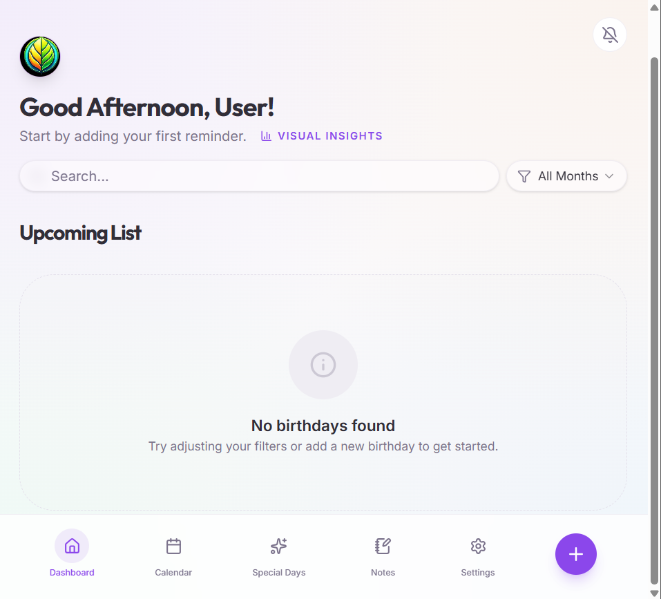
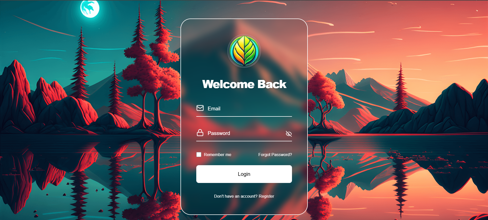
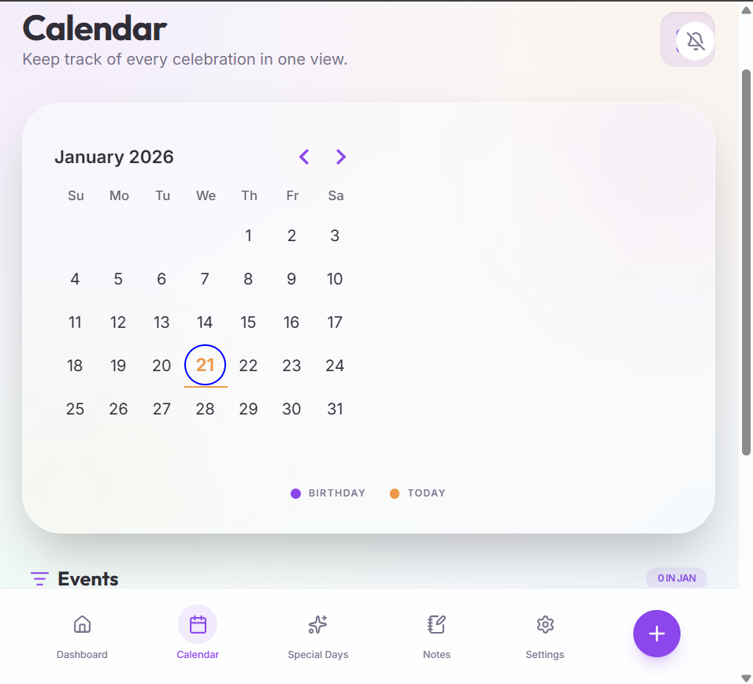
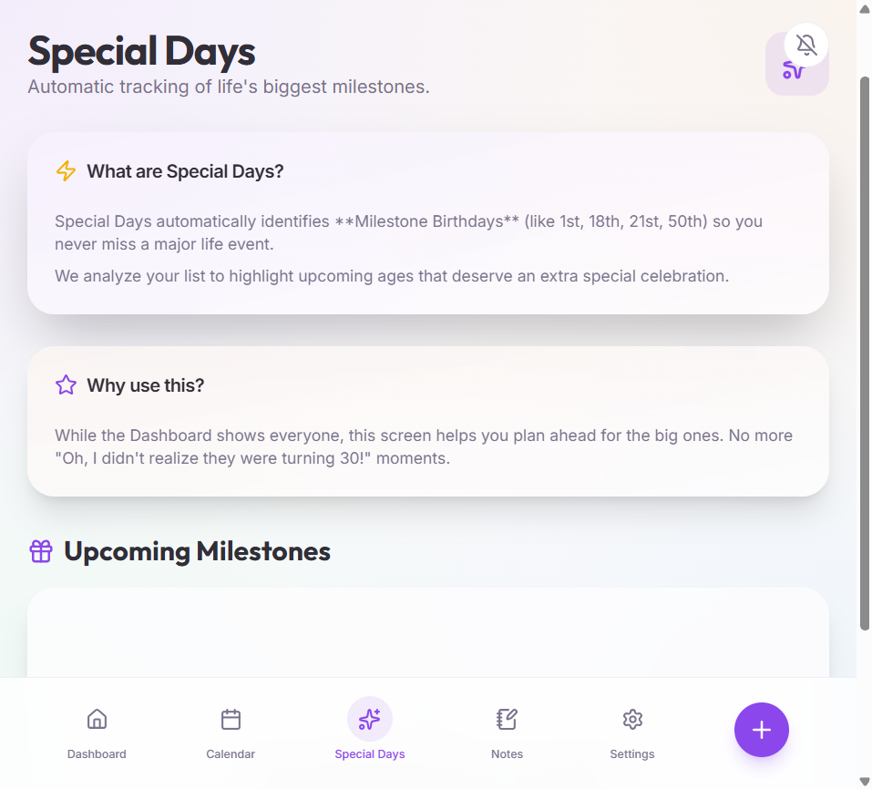

# 🎉 Birthday Beacon

A modern, full-stack **Birthday Reminder Web App** that helps you remember important birthdays and special days — built with a clean UI, smooth UX, and a production-ready backend.

🔗 **Live App:** https://birthday-beacon.onrender.com

---

## ✨ Features

- 🎂 Add & manage birthdays easily
- ⏰ Get reminders for upcoming birthdays
- 🗓️ Calendar view for special days
- 📝 Notes for birthdays & events
- ⚙️ Settings page for personalization
- 🔐 Authentication-ready backend
- 📱 Fully responsive & modern UI
- 🔄 SPA routing with refresh support

---

## 🖼️ Screenshots


### 🔹 Dashboard


### 🔹 Login Page


### 🔹 Calendar View


### 🔹 Calendar View

### 🔹 Settings Page


---

## 🛠️ Tech Stack

### Frontend
- **React**
- **Vite**
- **TypeScript**
- **Tailwind CSS**
- **Framer Motion**
- **Radix UI**

### Backend
- **Node.js**
- **Express**
- **TypeScript**
- **Session-based architecture**

### Tooling & DevOps
- **Git & GitHub**
- **Render (Web Service)**
- **Vite Build System**

---

## 🏗️ Project Structure

```

``` bash
Birthday-Beacon/
├── client/            # React frontend
│   ├── src/
│   ├── public/
│   └── assets/
├── server/            # Express backend
├── script/            # Build scripts
├── dist/              # Production build output
├── package.json
└── tsconfig.json
```


---

## 🚀 Deployment

This project is deployed as a **single Web Service** on **Render**, where:

- React is built using Vite
- Express serves the frontend from `dist/public`
- SPA routing works on refresh (`/settings`, `/login`, etc.)

### Render Configuration

Build Command: ```npm install && npm run build```
Start Command: ```npm start```
Environment:  ```Node```


---

## 🧪 Local Development

### 1️⃣ Install dependencies

```bash
npm install
```

### 2️⃣ Run in development

```bash
npm run dev
```

App runs at:

```
http://localhost:5000
```

---

## 🔐 Environment Variables

Create a `.env` file if needed:

```env
NODE_ENV=development
```

(Production variables are set in Render.)

---

## 📌 Why a Single Service?

* No CORS issues
* Clean session handling
* No routing bugs on refresh
* Easier deployment & maintenance

---

## 🌟 Future Enhancements

* 📧 Email birthday reminders
* 🔔 Push notifications
* 🗄️ Database persistence
* 🌐 Custom domain
* 🎨 Theme customization

---

## 👨‍💻 Author

**Lunar Vibes**
📍 India
